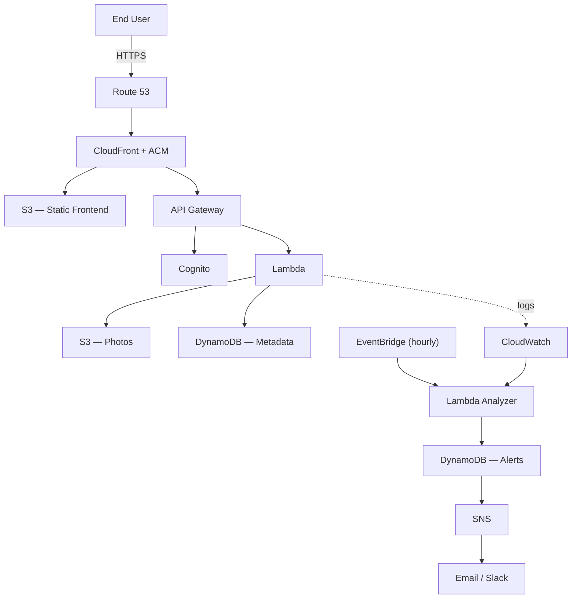
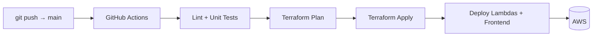

<div align="center">

# ☁️ CloudSecure Photos

**Cloud-native Photo Storage Platform with Integrated DevSecOps Detection — built on AWS with Infrastructure as Code and automated CI/CD.**

**Built with:** AWS Lambda · API Gateway · Cognito · S3 · DynamoDB · CloudFront · Terraform · GitHub Actions · CloudWatch

     

[Live Demo](https://claude.ai/chat/eb735574-8949-4293-a23e-bba1c90af117#live-demo) · [Architecture](https://claude.ai/chat/eb735574-8949-4293-a23e-bba1c90af117#architecture) · [Skills Demonstrated](https://claude.ai/chat/eb735574-8949-4293-a23e-bba1c90af117#skills-demonstrated) · [Full Documentation →](https://claude.ai/chat/docs/)

</div>

---

<p align="center">  </p> <p align="center"><sub><a href="#architecture-source">View Mermaid source</a> · full breakdown in <a href="assets/architecture/">assets/architecture</a></sub></p>

### Architecture at a Glance

|Layer|Purpose|
|---|---|
|Delivery|CloudFront, Route 53, ACM|
|Identity|Cognito authentication (JWT + Google OAuth)|
|Application|Lambda + API Gateway|
|Storage|S3 (objects) + DynamoDB (metadata)|
|Security|CloudWatch + EventBridge + SNS|

---

## Measured Results

|Metric|Value|
|---|---|
|Infrastructure provision time (`terraform apply`)|_e.g. 2m 31s — fill in_|
|Upload latency (p95)|_fill in_|
|API latency (p95)|_fill in_|
|Lambda cold start|_fill in_|
|Monthly cost (Cost Explorer)|_fill in_|

Full benchmark methodology (k6 load tests) in [`docs/testing-report.md`](https://claude.ai/chat/docs/testing-report.md).

---

## Live Demo

|Environment|URL|
|---|---|
|App|`photos.<your-domain>.cloud`|
|API|`api.photos.<your-domain>.cloud`|

_(Only publish a demo against a sandboxed bucket/account — never against production data.)_

<p align="center">    </p> <p align="center"><sub>Upload flow · Photo gallery · Security alerts dashboard</sub></p>

---

## Project Impact

CloudSecure Photos was built to demonstrate production-oriented Cloud Engineering practices, not just another CRUD app:

- **Zero always-on compute** — fully serverless, scales to zero, pay-per-use
- **Reproducible infrastructure** — the entire stack is provisioned from Terraform, no manual console changes
- **Automated deployments** — every merge to `main` ships through GitHub Actions with no manual steps
- **Secure by default** — private S3 buckets, short-lived pre-signed URLs, least-privilege IAM
- **Self-defending** — an event-driven engine detects brute-force, mass-download, and scanning behaviour from CloudWatch logs, with no third-party SIEM
- **Observable end-to-end** — dashboards, structured logs, custom metrics, and alerting from day one

---

## Skills Demonstrated

|Cloud Engineering Skill|Where it's demonstrated|
|---|---|
|Infrastructure as Code|Modular Terraform (`infrastructure/modules/*`), isolated `dev`/`prod` environments|
|Identity & Access Management|Cognito + JWT authorizers, per-function least-privilege IAM roles|
|Serverless Architecture|Lambda + API Gateway (HTTP API) + EventBridge|
|Storage & Data Modelling|S3 for objects, single-table DynamoDB design for metadata|
|CI/CD|GitHub Actions — lint → test → plan → apply → deploy, PR-gated|
|Observability|CloudWatch dashboards, alarms, custom metrics, CloudTrail audit trail|
|Security Automation|Event-driven anomaly detection engine + STRIDE threat model|

---

## Architecture



<a id="architecture-source"></a> _(Serverless application layer + independent security layer, connected only via CloudWatch logs and events. Full diagram with AWS icons, the upload sequence diagram, and the data model live in [`docs/architecture/`](https://claude.ai/chat/docs/architecture).)_

**Key decisions** (Lambda vs. ECS, DynamoDB vs. RDS, Cognito vs. Auth0, HTTP vs. REST API, pre-signed URLs vs. backend uploads) are documented with trade-offs in the [ADRs](https://claude.ai/chat/docs/adr/).

No VPC — every compute resource is a public-facing, stateless Lambda behind API Gateway. A VPC would add NAT costs, cold-start overhead, and Terraform complexity with no security benefit at this scale, since nothing here needs to reach a private network.

### System Design Goals

|Goal|Implementation|
|---|---|
|Scalability|Event-driven serverless architecture|
|Security|IAM least privilege + JWT + private S3 + CloudFront OAC|
|Cost efficiency|No always-on infrastructure|
|Reliability|Stateless Lambda functions|
|Maintainability|Terraform modules + ADRs|

### Security Controls

|Control|AWS Service|
|---|---|
|Authentication|Cognito (JWT)|
|Authorization|IAM policies, least privilege|
|Secrets|Secrets Manager _(where a real secret exists)_|
|TLS|ACM + CloudFront|
|Audit trail|CloudTrail|
|Monitoring|CloudWatch|
|Alerting|SNS|

Full STRIDE threat model: [`docs/threat-model.md`](https://claude.ai/chat/docs/threat-model.md)

---

## DevOps Pipeline



Pull requests run `terraform plan` only — nothing is applied outside `main`. `dev` and `prod` are fully independent pipelines.

---

## Features

**Photo platform** — Cognito auth (email/password + Google OAuth) · direct browser-to-S3 uploads via pre-signed URLs · personal gallery · ownership-validated download/delete · global CDN delivery

**Security engine** — brute-force, mass-download, and path-scanning detection from CloudWatch logs · DynamoDB-backed incident lifecycle (`OPEN → ACKNOWLEDGED → RESOLVED`) · SNS email alerts, optional Slack integration · IP allow-list

Full feature and detection-pattern breakdown: [`docs/`](https://claude.ai/chat/docs/)

---

## Getting Started

**Prerequisites:** AWS CLI · Terraform ≥ 1.6 · Python ≥ 3.12 · Node.js ≥ 20 · a Route 53 domain

```bash
git clone https://github.com/<your-user>/cloudsecure-photos.git && cd cloudsecure-photos

cp infrastructure/environments/dev/terraform.tfvars.example \
   infrastructure/environments/dev/terraform.tfvars   # set domain_name, aws_region, google_client_id

cd infrastructure/environments/dev
terraform init && terraform apply

cd ../../../frontend && npm install && npm run build
aws s3 sync dist/ s3://$(terraform output -raw frontend_bucket_name)
```

Full deployment walkthrough (including CI/CD setup): [`docs/deployment-guide.md`](https://claude.ai/chat/docs/deployment-guide.md)

---

## Tech Stack

**Frontend** React · TypeScript · Vite **Backend** Python 3.12 · AWS Lambda · API Gateway **Cloud** Cognito · S3 · DynamoDB · CloudFront · Route 53 · ACM · CloudTrail **DevOps** Terraform · GitHub Actions · CloudWatch · EventBridge · SNS

---

## Repository Tour

|Folder|Purpose|
|---|---|
|`/infrastructure`|Terraform modules and environments|
|`/backend`|Lambda functions (photos + anomaly detector)|
|`/frontend`|React application|
|`/assets`|Architecture diagrams, screenshots, GIFs|
|`/docs`|Architecture and engineering documentation|
|`/tests`|Unit, integration and load tests|

---

## Project Metrics

|Project Metric|Value|
|---|---|
|Terraform resources managed|_fill in — e.g. ~35_|
|Lambda functions|_fill in — e.g. 6_|
|GitHub Actions workflows|3|
|Detection patterns implemented|3|
|ADRs documented|5|

---

## Full Documentation

This README is deliberately short. Everything below lives in [`/docs`](https://claude.ai/chat/docs/):

|Document|Contents|
|---|---|
|[`assets/architecture/`](https://claude.ai/chat/assets/architecture)|AWS-icon diagrams, upload sequence, data model (images)|
|[`adr/`](https://claude.ai/chat/docs/adr)|5 Architecture Decision Records with trade-off analysis|
|[`threat-model.md`](https://claude.ai/chat/docs/threat-model.md)|Full STRIDE analysis|
|[`well-architected-review.md`](https://claude.ai/chat/docs/well-architected-review.md)|Review against all 6 AWS pillars|
|[`observability.md`](https://claude.ai/chat/docs/observability.md)|Dashboards, alarms, CloudTrail vs. CloudWatch|
|[`testing-report.md`](https://claude.ai/chat/docs/testing-report.md)|Unit/integration/load testing + k6 results|
|[`cost-analysis.md`](https://claude.ai/chat/docs/cost-analysis.md)|Estimated vs. measured cost, Cost Explorer breakdown|
|[`deployment-guide.md`](https://claude.ai/chat/docs/deployment-guide.md)|Full setup, environment config, troubleshooting|

---

## Roadmap

**Shipped** — Auth · Upload/Download/Delete · Anomaly detection engine · CI/CD · Terraform **Next** — AWS WAF · GuardDuty comparison · Geo-anomaly detection **Later** — Multi-region · automatic IP blocking on critical alerts · ML-based anomaly scoring

---

## Learning Outcomes

|Engineering Competency|Demonstrated Through|
|---|---|
|Cloud Architecture|Multi-layer AWS serverless design|
|DevSecOps|Event-driven anomaly detection engine|
|Infrastructure Automation|Terraform modules + CI/CD pipelines|
|Identity & Access Management|Cognito + IAM + JWT|
|Observability|Metrics, logs, alarms, dashboards|

---

## Author

**[Your Name]** — Cloud/DevOps Engineering portfolio project [LinkedIn](https://linkedin.com/in/your-profile) · [GitHub](https://github.com/your-username)