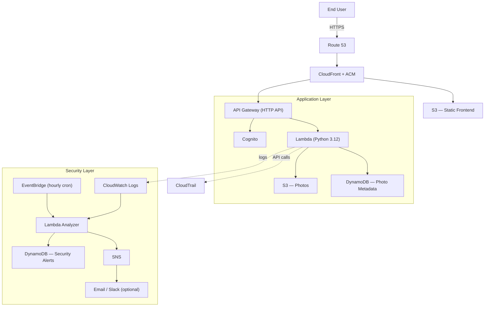
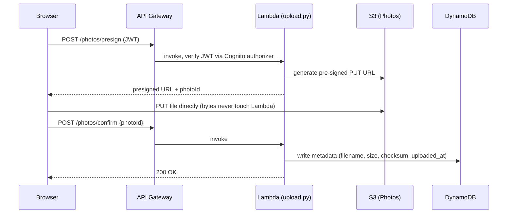
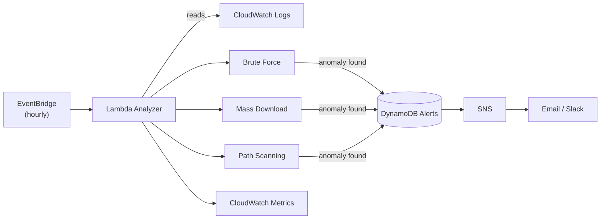
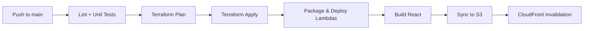

# ☁️ CloudSecure Photos

### Production-Inspired Serverless Photo Platform with DevSecOps Anomaly Detection on AWS

> A fully serverless photo storage platform built on AWS — Infrastructure as Code, automated CI/CD, and an integrated security anomaly-detection engine, designed against the AWS Well-Architected Framework.

     

<p align="center">  </p> <!-- Screenshot gallery (replace placeholders with real captures): docs/screenshots/login.png · gallery.png · alerts-dashboard.png docs/screenshots/cloudwatch-dashboard.png · cost-explorer.png docs/screenshots/github-actions-run.png · terraform-plan.png -->

> **Note on the title:** "Production-Inspired" until the checklist below is fully true for your deployment — CI/CD running green, HTTPS end-to-end, least-privilege IAM applied, tests passing, logs retained, and **measured** (not estimated) costs. Once all of that is real and demonstrable, rename this to "Production-Grade."

---

## Table of Contents

- [Executive Summary](https://claude.ai/chat/eb735574-8949-4293-a23e-bba1c90af117#executive-summary)
- [Live Demo](https://claude.ai/chat/eb735574-8949-4293-a23e-bba1c90af117#live-demo)
- [Project Highlights](https://claude.ai/chat/eb735574-8949-4293-a23e-bba1c90af117#project-highlights)
- [Architecture](https://claude.ai/chat/eb735574-8949-4293-a23e-bba1c90af117#architecture)
- [Data Flow — Upload Sequence](https://claude.ai/chat/eb735574-8949-4293-a23e-bba1c90af117#data-flow--upload-sequence)
- [Why This Architecture](https://claude.ai/chat/eb735574-8949-4293-a23e-bba1c90af117#why-this-architecture)
- [Security Threat Model](https://claude.ai/chat/eb735574-8949-4293-a23e-bba1c90af117#security-threat-model)
- [Audit Trail (CloudTrail)](https://claude.ai/chat/eb735574-8949-4293-a23e-bba1c90af117#audit-trail-cloudtrail)
- [Custom Detection vs. AWS Native Detection](https://claude.ai/chat/eb735574-8949-4293-a23e-bba1c90af117#custom-detection-vs-aws-native-detection)
- [Key Features](https://claude.ai/chat/eb735574-8949-4293-a23e-bba1c90af117#key-features)
- [Detection Engine](https://claude.ai/chat/eb735574-8949-4293-a23e-bba1c90af117#detection-engine)
- [Incident Response](https://claude.ai/chat/eb735574-8949-4293-a23e-bba1c90af117#incident-response)
- [DynamoDB Data Model](https://claude.ai/chat/eb735574-8949-4293-a23e-bba1c90af117#dynamodb-data-model)
- [Repository Structure](https://claude.ai/chat/eb735574-8949-4293-a23e-bba1c90af117#repository-structure)
- [Getting Started](https://claude.ai/chat/eb735574-8949-4293-a23e-bba1c90af117#getting-started)
- [CI/CD Pipeline](https://claude.ai/chat/eb735574-8949-4293-a23e-bba1c90af117#cicd-pipeline)
- [Observability](https://claude.ai/chat/eb735574-8949-4293-a23e-bba1c90af117#observability)
- [Performance Benchmarks](https://claude.ai/chat/eb735574-8949-4293-a23e-bba1c90af117#performance-benchmarks)
- [Testing Strategy](https://claude.ai/chat/eb735574-8949-4293-a23e-bba1c90af117#testing-strategy)
- [AWS Well-Architected Review](https://claude.ai/chat/eb735574-8949-4293-a23e-bba1c90af117#aws-well-architected-review)
- [Architecture Decision Records](https://claude.ai/chat/eb735574-8949-4293-a23e-bba1c90af117#architecture-decision-records)
- [Estimated & Measured Monthly Cost](https://claude.ai/chat/eb735574-8949-4293-a23e-bba1c90af117#estimated--measured-monthly-cost)
- [Roadmap](https://claude.ai/chat/eb735574-8949-4293-a23e-bba1c90af117#roadmap)
- [Technology Stack](https://claude.ai/chat/eb735574-8949-4293-a23e-bba1c90af117#technology-stack)
- [Learning Outcomes](https://claude.ai/chat/eb735574-8949-4293-a23e-bba1c90af117#learning-outcomes)
- [Author](https://claude.ai/chat/eb735574-8949-4293-a23e-bba1c90af117#author)

---

## Executive Summary

**CloudSecure Photos** lets authenticated users securely upload, manage, and retrieve personal photos — while a dedicated security layer continuously watches the platform for suspicious behaviour.

Unlike a typical photo-storage demo, this project ships with an **event-driven detection engine** that flags brute-force login attempts, mass-download exfiltration, and endpoint reconnaissance scans directly from CloudWatch logs, without any third-party SIEM.

It was built as a hands-on **Cloud Engineering / DevSecOps portfolio project**, and doubles as a capstone-style deliverable: it demonstrates Infrastructure as Code, CI/CD automation, least-privilege IAM, observability, and secure serverless design — the exact skill set expected of a junior Cloud/DevOps engineer.

---

## Live Demo

|Environment|URL|
|---|---|
|Production|`photos.<your-domain>.cloud`|
|API|`api.photos.<your-domain>.cloud`|
|Architecture docs|[`docs/architecture/`](https://claude.ai/chat/docs/architecture)|

- Guest/demo account: _fill in once seeded (read-only, sandboxed bucket recommended)_
- Upload flow GIF: `docs/screenshots/upload-demo.gif`
- Live alert GIF: `docs/screenshots/alert-demo.gif`

_(Only publish a demo account if it's scoped to a throwaway S3 prefix and rate-limited — never point a public demo at your real photo bucket.)_

---

## Project Highlights

|Highlight|Implementation|
|---|---|
|Infrastructure as Code|100% Terraform, modular by domain (networking, auth, api, storage, cdn, security)|
|Serverless Architecture|Lambda + API Gateway + S3 + DynamoDB|
|Authentication|Cognito + JWT + Google OAuth|
|DevSecOps|Event-driven anomaly detection, no third-party SIEM|
|CI/CD|GitHub Actions → Terraform Plan/Apply → AWS|
|Observability|CloudWatch dashboards, alarms, and custom metrics|

---

## Architecture

Three independent layers, connected only through well-defined APIs and event streams:



**For the final submission:** replace this Mermaid diagram with an AWS-icon diagram (draw.io / Cloudcraft) — numbered arrows, colour-coded by layer — saved as `docs/architecture/aws-diagram.drawio` + `.png`. Keep the Mermaid version underneath as a GitHub-native fallback; it's genuinely useful for reviewers reading the repo directly.

### AWS Services

|Layer|Services|
|---|---|
|Delivery|Route 53 · CloudFront · ACM|
|Authentication|Amazon Cognito (+ Google OAuth)|
|Compute|AWS Lambda (Python 3.12)|
|API|API Gateway — HTTP API|
|Storage|Amazon S3|
|Database|Amazon DynamoDB|
|Observability|CloudWatch Logs & Metrics · CloudTrail|
|Security Automation|EventBridge + Lambda Analyzer|
|Notifications|Amazon SNS|
|Secrets|AWS Secrets Manager _(only if you hold a real secret — see note below)_|
|Infrastructure|Terraform|
|CI/CD|GitHub Actions|

---

## Data Flow — Upload Sequence



This is the diagram to point to when explaining _why_ pre-signed URLs matter: the file payload never passes through compute, so upload cost and latency scale with S3, not with Lambda.

---

## Why This Architecture

Engineering trade-offs, not just tool choices:

**Lambda vs. ECS/EC2** — Traffic is intermittent and event-driven. Lambda scales to zero and bills per invocation; EC2/ECS would carry a fixed 24/7 cost with no meaningful benefit at this scale.

**DynamoDB vs. RDS/PostgreSQL** — Photo metadata is simple, key-based, and doesn't need joins. DynamoDB gives single-digit-millisecond latency, on-demand scaling, and no idle-instance cost — RDS would be paying for a database server that sits mostly idle.

**Cognito vs. Auth0 / custom auth** — Cognito integrates natively with API Gateway and IAM, supports Google federation at no extra cost, and removes the liability of ever storing a password.

**HTTP API vs. REST API (API Gateway)** — HTTP API is roughly 70% cheaper, has lower latency, and supports native JWT authorizers against Cognito. REST API is only justified when per-endpoint caching or API keys are required — neither applies here.

**Pre-signed S3 URLs vs. backend-proxied uploads** — Uploads go directly from the browser to S3, so Lambda never touches file bytes: lower cost, no 6 MB payload limit, and no unnecessary compute in the critical path.

---

## Security Threat Model

A lightweight STRIDE pass over the platform's attack surface:

|Threat|Mitigation|
|---|---|
|**S**poofing|Cognito-issued JWTs validated on every request; IAM roles scoped per Lambda|
|**T**ampering|S3 pre-signed URLs with short expiry; explicit ownership checks before delete/download|
|**R**epudiation|CloudWatch Logs (90-day retention) + CloudTrail for account-level audit trail|
|**I**nformation Disclosure|S3 buckets fully private; CloudFront Origin Access Control; no public bucket policies|
|**D**enial of Service|CloudFront edge caching; optional AWS WAF managed rule groups; API Gateway throttling|
|**E**levation of Privilege|Least-privilege IAM per function; no shared execution roles between modules|

---

## Audit Trail (CloudTrail)

CloudWatch tells you _what the application did_; CloudTrail tells you _what happened to the AWS account itself_ — the two are complementary, not redundant:

|Source|Captures|Used for|
|---|---|---|
|CloudWatch Logs|Application-level events emitted by Lambda|Anomaly detection engine, app debugging|
|CloudTrail|IAM changes, Cognito admin events, S3 data-plane access, Lambda invocations at the API level|Forensic audit, compliance, "who changed what"|

CloudTrail is enabled account-wide with a dedicated, write-once-read-many S3 destination bucket (separate from the photos bucket) so audit logs can't be tampered with even by a compromised application role.

---

## Custom Detection vs. AWS Native Detection

The Lambda Analyzer is a **custom, log-pattern-based** detector. It's worth explicitly comparing it to AWS's managed alternative rather than presenting it as a replacement for one:

|Service|What it adds|Relationship to the custom engine|
|---|---|---|
|**AWS WAF**|Bot blocking, rate limiting, managed rule groups at the CloudFront edge|Complementary — stops obvious abuse before it ever reaches Lambda or generates logs to analyze|
|**GuardDuty**|ML-based, continuously-updated threat intelligence across the whole account|A benchmark — GuardDuty catches things a threshold-based analyzer won't (e.g. known-bad IPs, unusual API call sequences); the custom engine catches _domain-specific_ patterns (e.g. "50 downloads in 10 minutes from this specific user") that a generic detector has no context for|

Recommended framing for the write-up: dedicate a short chapter to "custom detection vs. managed detection," running both side-by-side and comparing what each one alone would have missed. That comparison is a stronger engineering argument than either service alone.

---

## Key Features

### Cloud Photo Platform

- Email/password and Google OAuth sign-in via Cognito
- Direct browser-to-S3 uploads using pre-signed URLs
- Personal gallery backed by DynamoDB metadata
- Ownership-validated download and delete
- Global delivery through CloudFront

### DevSecOps Security Engine

|Pattern|Description|Threshold|
|---|---|---|
|Brute force|Repeated failed logins from one IP|>10 attempts / 5 min|
|Mass exfiltration|Unusual photo-download volume|>50 downloads / 10 min|
|Path scanning|Requests to non-existent endpoints|>20 distinct paths / 1 min|
|Geo anomaly _(planned)_|Login from an unexpected country|—|
|Rate abuse _(planned)_|Excessive API request rate|—|

Every detected incident: writes a `DynamoDB` record → publishes an `SNS` alert → updates a `CloudWatch` metric → can be acknowledged or marked as a false positive.

> Slack notifications are an **optional integration**, not a hard dependency — the engine works end-to-end on email/SNS alone, which matters if a reviewer or examiner doesn't have Slack.

---

## Detection Engine



**Incident lifecycle:** `OPEN` → `ACKNOWLEDGED` → `RESOLVED` (or `FALSE_POSITIVE`)

Trusted IPs (offices, corporate VPNs) live in a DynamoDB allow-list the analyzer checks first — updatable without a redeploy.

---

## Incident Response

What actually happens after an anomaly is detected, by severity:

|Severity|Response|
|---|---|
|Low|Incident stored in DynamoDB only; visible on next review|
|Medium|SNS email notification|
|High|Slack notification _(if configured)_ + email|
|Critical _(planned)_|AWS WAF automatically blocks the offending IP|

---

## DynamoDB Data Model

**Photos table**

- Partition key: `USER#{userId}`
- Sort key: `PHOTO#{timestamp}`
- Attributes: `filename`, `uploaded_at`, `content_type`, `size`, `checksum`

**Security Alerts table**

- Partition key: `ALERT#{alertId}`
- Attributes: `user_id`, `ip_address`, `anomaly_type`, `severity`, `status`, `detected_at`

---

## Repository Structure

```text
cloudsecure-photos/
├── infrastructure/          # Terraform — networking, auth, api, storage, cdn, security
│   └── environments/{dev,prod}/
├── backend/
│   ├── photos/               # upload · list · delete · download
│   ├── anomaly_detector/      # analyzer + patterns + notifier
│   └── shared/                # auth · db helpers
├── frontend/                 # React + TypeScript + Vite
├── docs/
│   ├── architecture/
│   │   ├── aws-diagram.drawio
│   │   ├── aws-diagram.png
│   │   ├── upload-sequence.png
│   │   ├── detection-flow.png
│   │   └── data-model.png
│   ├── adr/
│   │   ├── ADR-001-serverless-vs-containers.md
│   │   ├── ADR-002-dynamodb-vs-rds.md
│   │   ├── ADR-003-cognito-auth.md
│   │   ├── ADR-004-http-vs-rest-api.md
│   │   └── ADR-005-presigned-url.md
│   ├── screenshots/
│   ├── threat-model.md
│   ├── testing-report.md
│   ├── well-architected-review.md
│   └── cost-analysis.md
├── tests/{unit,integration}/
└── .github/workflows/         # deploy-infra · deploy-backend · deploy-frontend
```

---

## Getting Started

**Prerequisites:** AWS CLI configured · Terraform ≥ 1.6 · Python ≥ 3.12 · Node.js ≥ 20 · a Route 53 domain

```bash
git clone https://github.com/<your-user>/cloudsecure-photos.git
cd cloudsecure-photos

# 1. Configure environment
cp infrastructure/environments/dev/terraform.tfvars.example \
   infrastructure/environments/dev/terraform.tfvars
# edit: domain_name, aws_region, google_client_id

# 2. Provision infrastructure
cd infrastructure/environments/dev
terraform init && terraform plan && terraform apply

# 3. Deploy frontend
cd ../../../frontend
npm install && npm run build
aws s3 sync dist/ s3://$(terraform output -raw frontend_bucket_name)
aws cloudfront create-invalidation \
  --distribution-id $(terraform output -raw cloudfront_distribution_id) --paths "/*"
```

> In production, every step above runs automatically through GitHub Actions.

---

## CI/CD Pipeline



Pull requests run **Plan only** — nothing is applied until merged to `main`. `dev` and `prod` run as fully independent pipelines.

---

## Observability

CloudWatch dashboard tracks Lambda duration/errors, API latency, upload/download counts, and security-alert volume.

**Security dashboard** (screenshot at `docs/screenshots/cloudwatch-dashboard.png`) breaks these down further:

|Widget|What it shows|Why it matters|
|---|---|---|
|Uploads / Downloads (per hour)|Traffic baseline|Lets you eyeball what "normal" looks like before trusting the anomaly thresholds|
|Lambda Errors|Error rate per function|Distinguishes a real incident from a broken deploy|
|Alert Count by Severity|Volume of Low/Medium/High/Critical incidents over time|Tuning signal — too many Lows means thresholds are too tight|

---

## Performance Benchmarks

Measured, not estimated — replace with real numbers from a k6 run before submission:

| Metric                               | Value     |     |
| ------------------------------------ | --------- | --- |
| Upload latency (p95, presigned flow) | _fill in_ |     |
| API Gateway latency (p95)            | _fill in_ |     |
| Lambda cold start (Python 3.12)      | _fill in_ |     |
| Concurrent uploads sustained         | _fill in_ |     |
| Monthly invocations (dev traffic)    | _fill in_ |     |

_(Reviewers weight measured results far more than estimates — this table only earns its place once it's filled in.)_

---

## Testing Strategy

- **Unit** — Lambda handlers, detection patterns, JWT validation
- **Integration** — upload/download flow, authorization, incident generation
- **Load** — [k6](https://k6.io/) scenarios: concurrent uploads, burst downloads, login brute-force simulation

---

## AWS Well-Architected Review

|Pillar|Status|Notes|
|---|---|---|
|Operational Excellence|✅|Full IaC, automated CI/CD, centralized logging|
|Security|✅|Least-privilege IAM, Secrets Manager (where a real secret exists), HTTPS enforced|
|Reliability|⚠️|Single-region; multi-region is a Phase 3 goal|
|Performance Efficiency|✅|Serverless, CloudFront caching, pre-signed URLs|
|Cost Optimization|✅|Pay-per-use, no idle instances, free-tier maximized|
|Sustainability|✅|Serverless reduces footprint vs. always-on servers|

---

## Architecture Decision Records

Full rationale for each decision lives in `/docs/adr/`:

- ADR-001 — Serverless vs. Containers
- ADR-002 — DynamoDB vs. PostgreSQL
- ADR-003 — Cognito vs. Auth0
- ADR-004 — HTTP API vs. REST API
- ADR-005 — Pre-Signed URLs vs. Backend Uploads

---

## Estimated & Measured Monthly Cost

Estimate for personal use, ~1,000 photos, low traffic (AWS free tier included):

|Service|Estimated|Measured _(Cost Explorer)_|
|---|---|---|
|Lambda|~$0.00 (free tier)|_fill in_|
|API Gateway|~$0.04|_fill in_|
|S3|~$0.12|_fill in_|
|DynamoDB|~$0.25|_fill in_|
|CloudFront|~$0.85|_fill in_|
|Route 53|~$0.50|_fill in_|
|CloudWatch|~$0.50|_fill in_|
|SNS|~$0.00 (free tier)|_fill in_|
|**Total**|**≈ $2.25/month**|_fill in_|

Add a Cost Explorer screenshot (`docs/screenshots/cost-explorer.png`) once you've run the stack for a full billing cycle — a _measured_ total is far more convincing in a defense than an estimate.

> Real costs scale with traffic — see the [AWS Pricing Calculator](https://calculator.aws/) for production-scale estimates.

---

## Roadmap

**MVP** ✅ — Auth · Upload · Gallery · Download · Delete · CI/CD · Terraform

**Phase 2** — Security dashboard · AWS WAF · Geo-anomaly detection · optional Slack notifications

**Phase 3** — Multi-region disaster recovery · automatic IP blocking · ML-based anomaly scoring · GuardDuty comparison chapter

---

## Technology Stack

**Frontend** — React · TypeScript · Vite **Backend** — Python 3.12 · AWS Lambda · API Gateway **Cloud** — Cognito · S3 · DynamoDB · CloudFront · Route 53 · ACM · CloudTrail **DevOps** — Terraform · GitHub Actions · CloudWatch · EventBridge · SNS

---

## Learning Outcomes

Practical, demonstrable experience with: cloud architecture design · Infrastructure as Code · DevSecOps · serverless computing · identity & access management · observability · CI/CD automation · the AWS Well-Architected Framework.

---

## Author

**[Your Name]** Cloud/DevOps portfolio project — built independently as a hands-on capstone-style deliverable.

[](https://linkedin.com/in/your-profile) [](https://github.com/your-username)